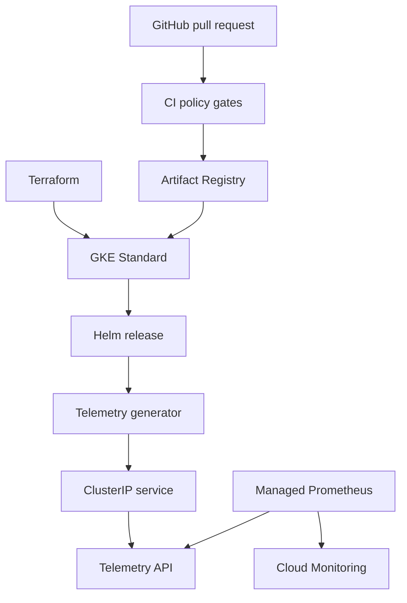

# GreenGrid: Secure Kubernetes Platform for Energy Telemetry

GreenGrid is an employer-facing platform-engineering project built around a small energy-telemetry workload. The application is intentionally simple; the engineering focus is repeatable GKE infrastructure, hardened Kubernetes workloads, controlled change, observability, and evidence-driven troubleshooting.

## What is implemented

| Layer | Current state |
| --- | --- |
| Application | FastAPI telemetry API plus a synthetic telemetry generator, structured JSON logs, health endpoints, Prometheus metrics, bounded retention, retry/backoff, and 14 contract/unit tests |
| Containers | Digest-pinned Python base, non-root UID/GID 10001, read-only root filesystems, dropped capabilities, bounded resources, health checks, and a runtime security verification script |
| GCP infrastructure | Reusable Terraform modules for required APIs, custom VPC/subnet, Artifact Registry, least-privilege node IAM, and one zonal Standard GKE development cluster in `us-east4-b` |
| Kubernetes | One Helm chart with dev/staging/prod values, 19 rendered resources per environment, probes, HPA, PDB, quotas, dedicated ServiceAccounts, and default-deny network policy |
| Observability | GKE managed Prometheus collection, a namespaced `PodMonitoring` target for `/metrics`, restricted collector ingress, GKE system/workload logging, and a development-only HPA load-simulation endpoint |
| Delivery controls | Four GitHub Actions gates for application/dependency checks, Helm policy checks, Terraform checks, and the running container contract; Dependabot covers actions, Python, Docker, and Terraform |

The development infrastructure and workload path have been deployed and exercised. This repository does **not** claim that staging, production, Argo CD, a durable data store, public ingress, or multi-region recovery are live. Those are explicit production extensions, not hidden gaps.

## Architecture at a glance



Terraform owns persistent GCP resources. Helm owns namespace-scoped Kubernetes resources. The generator resolves the internal Service name and submits telemetry over TCP 8000. The API validates and retains a bounded in-memory working set, exposes health and metrics endpoints, and has no external Service. Managed Prometheus collectors scrape each API pod and push metrics to Cloud Monitoring.

See [the detailed architecture](docs/architecture.md), [the interview walkthrough](docs/interview-walkthrough.md), and [the troubleshooting runbook](docs/runbooks/gke-troubleshooting.md).

## Security and reliability controls

- VPC-native GKE with Dataplane V2, Shielded Nodes, Secure Boot, auto-repair, auto-upgrade, and surge upgrades.
- Dedicated keyless node identity plus Workload Identity Federation for GKE; no service-account keys.
- Dedicated Kubernetes ServiceAccounts with token automount disabled.
- Restricted-style pod/container security contexts, immutable Git-SHA application image tags, and no `latest` tags.
- Default-deny ingress/egress, narrow DNS, generator-to-API, Helm-test-to-API, and managed-collector-to-API paths.
- Explicit requests/limits, namespace quota/limit range, three probe types, CPU HPA, and environment-aware PDBs.
- Read-only CI permissions, commit-pinned actions, vulnerability auditing, and automated manifest policy assertions.

## Local validation

Python 3.12 is required.

```sh
make install
make validate
make dependency-audit
make helm-verify
make terraform-verify
```

`make terraform-verify` initializes with `-backend=false` and never plans, applies, or destroys infrastructure. `make helm-verify` renders and verifies dev, staging, and production without installing them.

To verify the complete local container path:

```sh
make verify
```

That command builds both images, waits for health, confirms telemetry delivery, verifies UID/GID 10001, proves the root filesystems are read-only, checks the writable `/tmp` mounts, and inspects the dropped-capability/no-new-privileges runtime settings.

## Safe development deployment outline

Cloud mutation is intentionally separate from validation. After reviewing a Terraform plan and receiving explicit approval:

1. Provision or update the development GCP foundation from `terraform/environments/dev`.
2. Build each image once, tag it as `git-<40-character-commit-sha>`, and publish it to the approved repository.
3. Create and label `greengrid-dev` with the Kubernetes restricted Pod Security Standard.
4. Install or upgrade the Helm chart with the development values and immutable image tags.
5. Verify rollouts, `helm test`, telemetry flow, HPA state, PodMonitoring target health, logs, and PromQL results.

Exact commands and rollback checks are in [the deployment process](docs/deployment-process.md).

## Problems this project demonstrates

- **Default deny broke service discovery:** the generator entered a restart loop because DNS egress was denied. Logs and endpoint checks isolated DNS from application failure; a narrowly scoped TCP/UDP 53 policy restored name resolution while preserving default deny.
- **Dependencies drifted into known advisories:** a vulnerability audit found the old Starlette/Pytest stack was no longer clean. Dependencies and the digest-pinned Python base were upgraded, tests were expanded, and the audit became a required CI gate.
- **Metrics existed but were not collected:** the API exposed valid Prometheus text, while GKE managed collection was disabled and no scrape resource existed. Terraform now enables collection, Helm creates `PodMonitoring`, the network policy admits only Standard GKE collectors, and scrape limits bound cost/cardinality.
- **Architecture claims exceeded automation:** documentation described CI and future GitOps as though they were complete. The repository now contains enforceable CI gates and clearly labels Argo CD and live higher environments as future work.

## Repository structure

- `applications/`: telemetry API and generator source plus hardened Dockerfiles
- `terraform/`: reusable GCP modules and the deployable development root
- `helm/`: multi-environment workload chart
- `.github/`: CI, dependency maintenance, and review templates
- `scripts/`: container, Helm-policy, and Terraform-security verification
- `docs/`: architecture, operations, security, ADRs, runbooks, and interview material
- `tests/`: application, metrics, bounds, and retry behavior

## Production boundary

A real production version would use separate GCP projects and state, a regional private cluster, controlled egress, durable managed storage, authenticated/TLS ingress, signed-image admission, stronger SLOs/alerts, backups and restore drills, and a reconciler such as Argo CD. See [production improvements](docs/production-improvements.md).
