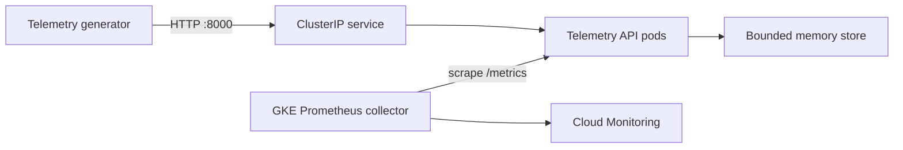
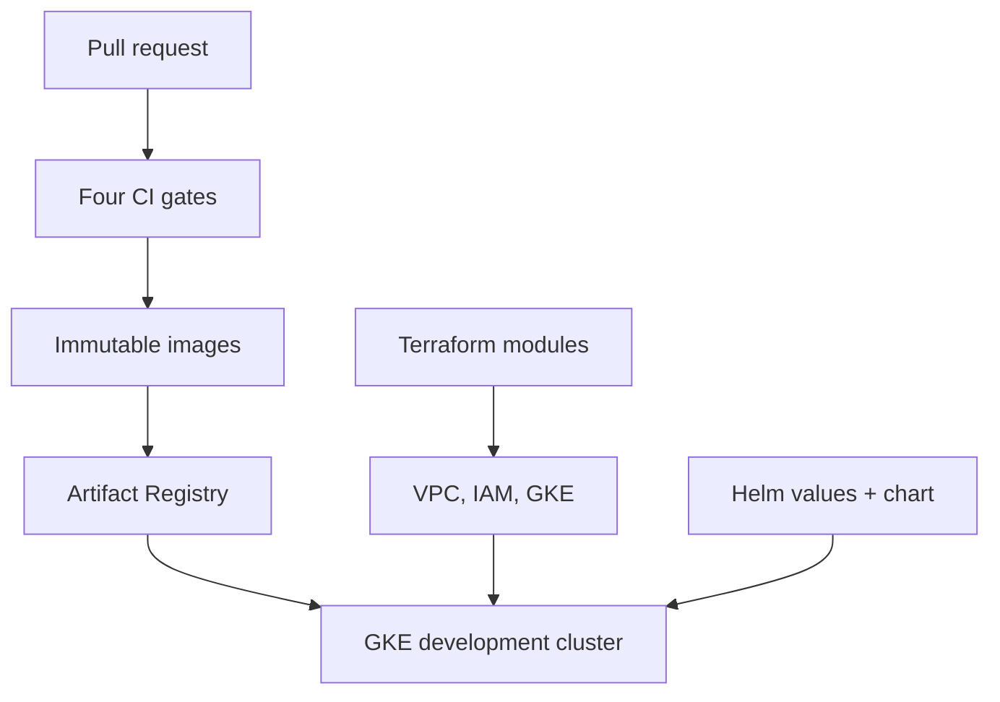

# Architecture

## Purpose and scope

GreenGrid demonstrates how a small internal service can be delivered to GKE with production-style infrastructure boundaries, security controls, operational signals, and review gates. It is a working development platform and a documented production design, not a claim that a production energy system is running.

## System context

The synthetic generator models battery, wind, and marine assets. It sends validated JSON telemetry to an internal FastAPI service. The API retains only a bounded in-memory window so the project stays focused on platform engineering; a durable store is a known production requirement.

There is no external load balancer or public application ingress. Kubernetes DNS is the service-discovery mechanism. NetworkPolicy permits only DNS, generator-to-API, Helm-test-to-API, and managed-collector-to-API traffic.

## Delivery and infrastructure boundaries

| Boundary | Owner | Reason |
| --- | --- | --- |
| Required APIs, VPC/subnet, Artifact Registry, IAM, GKE | Terraform | Persistent cloud resources need plans, state, review, and lifecycle control |
| Deployments, Service, ConfigMaps, HPA/PDB, policies, PodMonitoring | Helm | Workload configuration changes at application cadence and needs environment overlays |
| Application behavior and telemetry schema | Python services | Keeps business behavior testable without a cluster |
| Pull-request validation | GitHub Actions | Provides repeatable evidence before merge without cloud credentials or automatic apply |

CI is deliberately non-deploying. Pull requests do not receive GCP credentials, and `terraform apply` is never run from the validation workflow. A later delivery workflow should use short-lived federation, protected environments, and immutable digests.

## GCP foundation

The deployable development root composes five modules:

1. `project-services` enables the minimum APIs used by the platform.
2. `network` creates a custom-mode VPC, a `us-east4` subnet, and separate node/Pod/Service ranges.
3. `artifact-registry` creates the Docker repository.
4. `iam` creates a keyless node service account with the GKE node and metrics-writer roles plus repository-scoped pull access.
5. `gke` creates a zonal Standard cluster and separate autoscaling node pool.

The cluster uses VPC-native alias IPs, Dataplane V2, intranode visibility, Shielded Nodes, Secure Boot, Workload Identity Federation for GKE, system/workload logging, system monitoring, and managed Prometheus collection. The one-to-three-node `e2-standard-2` pool has auto-repair, auto-upgrade, and a surge strategy of one extra node with zero unavailable during upgrade.

The zonal control plane and public development nodes are explicit cost decisions. A production design would be regional, private, and protected by controlled egress and restricted control-plane access.

## Kubernetes workload layer

Each environment currently renders 18 resources:

| Resource | Count | Operational purpose |
| --- | ---: | --- |
| Deployments | 2 | Run the API and generator independently |
| ServiceAccounts | 2 | Avoid the default identity and disable token automount |
| ConfigMaps | 2 | Hold non-secret runtime configuration |
| ClusterIP Service | 1 | Stable internal API discovery and routing |
| HPA | 1 | Scale API pods on CPU utilization relative to requests |
| PDB | 1 | Bound voluntary disruption according to environment size |
| ResourceQuota / LimitRange | 2 | Bound namespace consumption and defaults |
| NetworkPolicies | 5 | Default deny plus four required traffic paths |
| PodMonitoring | 1 | Discover and scrape the API metrics endpoint |
| Helm test Pod | 1 | Verify readiness through the real Service path |

All workload containers run as UID/GID 10001 with a read-only root filesystem, `RuntimeDefault` seccomp, no privilege escalation, and all Linux capabilities dropped. Memory-backed `/tmp` volumes provide the only intended writable path.

## Reliability behavior

- The API separates startup, readiness, and liveness endpoints so startup delay or temporary unready state does not cause unnecessary restarts.
- The generator has no listener; its health marker is refreshed only after successful delivery. Failed DNS/API delivery therefore affects readiness and eventually liveness.
- Generator HTTP failures use bounded exponential backoff. Retriable network/5xx failures are retried; 4xx failures fail fast.
- API requests and memory are bounded. `/simulate-load` caps CPU work at five seconds, is registered only when explicitly enabled, and is enabled only by the development Helm values.
- The HPA controls live API replica count. PDB values account for the different replica floors in dev, staging, and production values.
- Rolling updates use `maxUnavailable: 0` and `maxSurge: 1`.

## Observability path

The API exposes typed Prometheus gauge and counter metrics at `/metrics`. GKE managed collection runs a collector per node, and the namespaced `PodMonitoring` resource selects only API pods by stable labels. Scrapes use the named `http` port every 30 seconds with a 10-second timeout and explicit sample/label limits.

Default-deny ingress would otherwise block the scrape. A separate NetworkPolicy permits TCP 8000 only from pods labeled `app.kubernetes.io/name=collector` in the Standard GKE `gmp-system` namespace. Collectors use the node identity to write metrics; the node account receives only the predefined GKE node role, `roles/monitoring.metricWriter`, and repository-scoped image pull access.

## Environment and truth boundaries

| Environment | Configuration | Live claim |
| --- | --- | --- |
| Development | Deployable Terraform root and Helm values | Previously provisioned and exercised; any new infrastructure/chart change still requires a reviewed plan and upgrade |
| Staging | Helm values and documented design | Not claimed as a live cluster |
| Production | Helm values and documented design | Not claimed as a live cluster |

Argo CD remains a planned delivery extension. Until it is implemented and demonstrated, GreenGrid should be described as GitOps-oriented rather than GitOps-operated.

## Main tradeoffs to explain

- **Standard GKE over Autopilot:** exposes node-pool, upgrade, identity, and networking decisions that are valuable for a platform-engineering demonstration.
- **Zonal dev over regional dev:** controls portfolio cost; it consciously gives up control-plane and node-zone resilience.
- **Public dev nodes over Cloud NAT:** avoids fixed NAT cost; production requires private nodes and controlled egress.
- **In-memory data over a database:** keeps the workload small and makes retention behavior deterministic; it is not durable or shared across replicas.
- **CI validation without automatic apply:** reduces credential and blast-radius risk; delivery remains a reviewed operational step until federation and protected environments are implemented.
